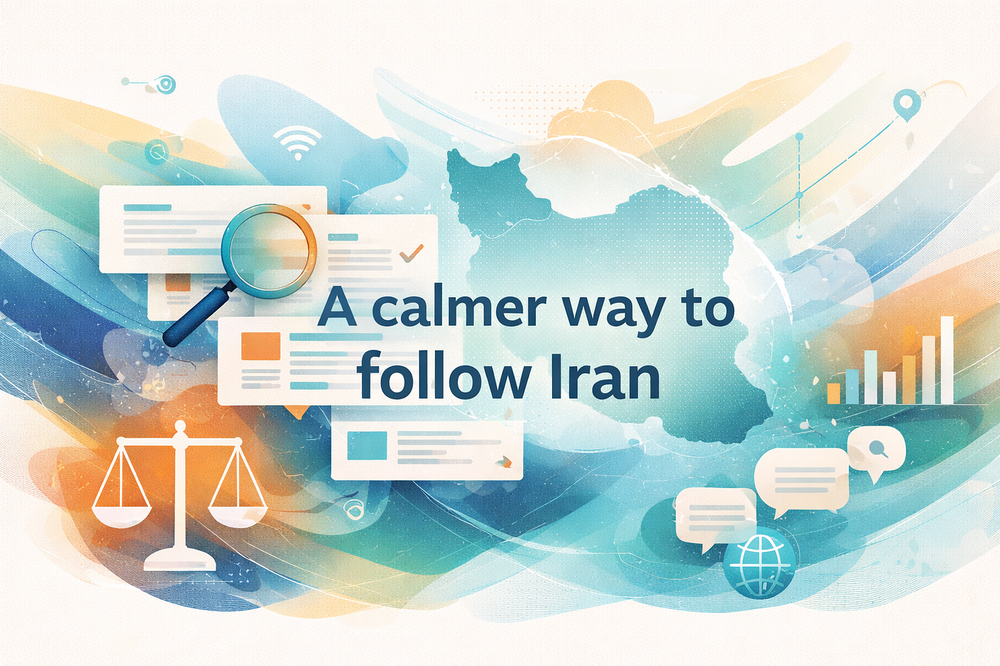

# A calmer way to follow Iran: let an AI agent do the digging, not your nervous system

*Originally published on Medium, January 12, 2026*

By Sam Jafari

---

A few years ago, my “Iran update loop” looked like most people’s.

I opened social media. I scrolled. I absorbed a flood of reposts: emotional captions, graphic imagery, cropped videos with no context, and confident takes from people who were either deeply invested or completely removed. Left, right, center, monarchy, reform, revolution, foreign policy hawks, conspiracy threads, you name it. The same handful of claims bounced around the same bubbles, getting louder each time.

It felt like staying informed. In reality, it was a stress machine.

Two things make Iran uniquely hard to track in real time:

1. Information scarcity and distortion. During unrest, connectivity gets restricted and reporting becomes fragmented. NetBlocks has repeatedly documented major disruption events affecting Iran’s connectivity, and Reuters has reported on blackouts attributed to monitoring groups like NetBlocks. (NetBlocks)
2. Information overload with incentives to manipulate. When facts are hard to verify, engagement rewards the most emotional content, not the most accurate content.

So I switched the workflow.

Instead of feeding myself raw social media, I built a simple “news digestion agent” in ChatGPT that does three jobs for me:

- Pulls updates from multiple reputable outlets across different editorial slants
- Separates confirmed facts from claims and uncertainty
- Summarizes what actually changed since the last update, without forcing me to consume traumatic imagery

This is the same idea I wrote about in a different context: AI works best as an amplifier of human judgment, not a replacement for it.

## What this gives you, practically

- You stay informed without doomscrolling.
- You get a short snapshot once or twice a day.
- If something matters, you drill down intentionally: “show me the sources behind bullet 3” instead of “scroll until my brain is cooked.”
- You reduce the odds of getting captured by one political tribe’s narrative.

Also, this is not about “finding the truth” from AI. AI can be wrong. The point is work reduction plus structure: it does the exhausting aggregation and cross checking, and you keep the final judgment.

## How to use this (quick setup)

1. In ChatGPT, create a Project (for example: “Iran Briefing”).
2. Paste the Project Instructions prompt below into the Project’s instruction area.
3. Once or twice a day, ask:

- “Give me the latest Iran update. Focus on what changed in the last 12 to 24 hours.”
- “What changed since your last update?”
- “Show sources for bullet 2 and bullet 6.”

That’s it.

If you want to go deeper, you can ask the agent to summarize what credible analysts are saying, but still keep it anchored to evidence and clearly label speculation.

## Why the prompt is written this way

When information is contested, the biggest failure mode is not lack of data. It is mixed certainty: confirmed facts, plausible claims, propaganda, and rumors all blended together.

So the prompt forces three behaviors:

- Triangulation: multiple outlets, not one feed
- Epistemic labels: confirmed vs unconfirmed vs disputed
- Verification mindset: “what would change my confidence?” rather than “what do I want to be true?”

That approach mirrors how professional investigators handle digital evidence: verify time, place, and context, and explicitly fight misinformation patterns. Amnesty’s Evidence Lab and its verification work describe this mindset clearly, including building timelines and countering mis and disinformation during crises. (Amnesty International)
UNESCO also publishes practical guidance on information verification and media literacy skills that align with the same principles. (UNESCO Articles)

Finally, internet shutdowns are not rare exceptions anymore. Access Now’s KeepItOn work documents shutdowns globally and explains how they track and verify them, including annual reporting. (Access Now)

## Copy and paste: ChatGPT Project Instructions prompt

## A simple daily rhythm (that actually works)

If you want this to stay healthy, keep it boring:

- Morning: “Latest update, last 12 to 24 hours.”
- Late afternoon: “What changed since your last update?”
- Only drill down when something is genuinely new or actionable.

The point is not to feel everything. The point is to understand what is happening, with enough signal to make good decisions.

---

*Originally published on [Medium](https://medium.com/@samjafari/a-calmer-way-to-follow-iran-let-an-ai-agent-do-the-digging-not-your-nervous-system-86835d3c14a1), January 12, 2026.*
