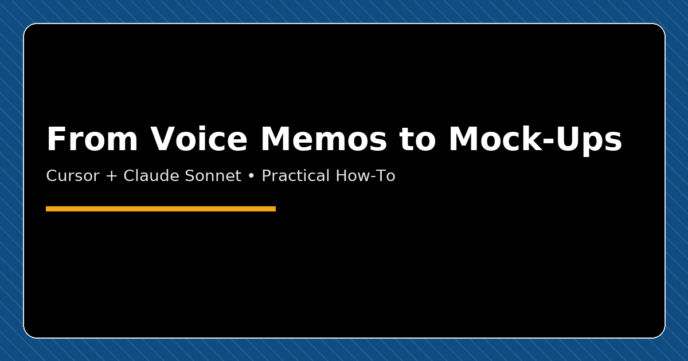
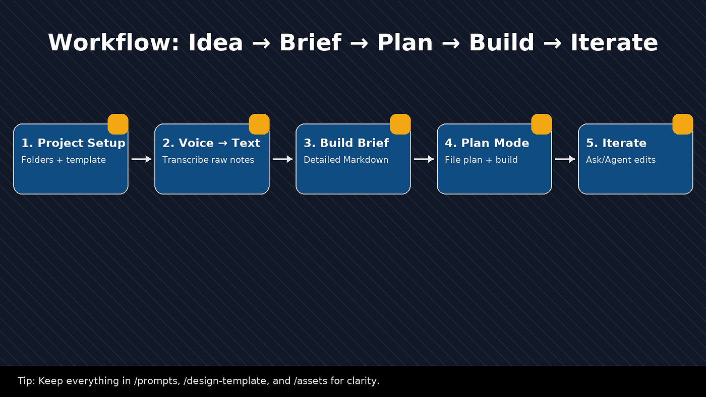
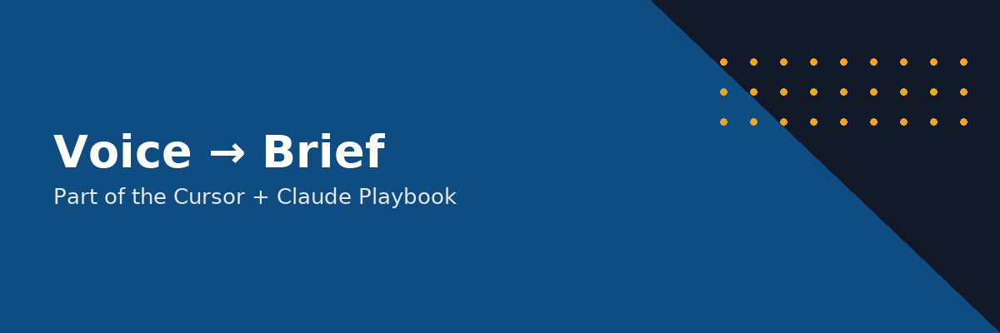
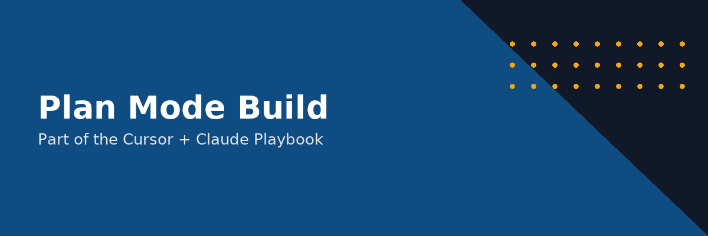
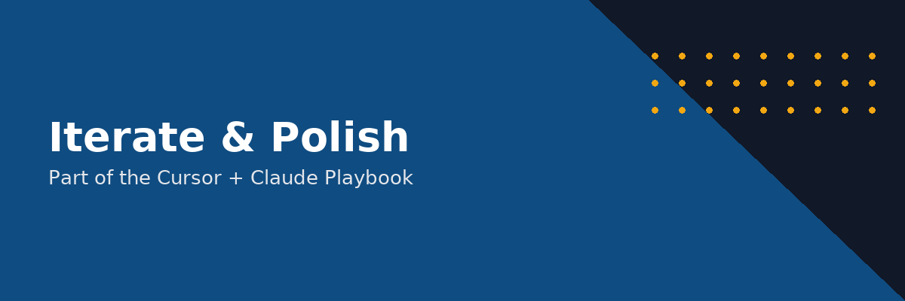

# A simple playbook to mock up websites fast with AI

*Originally published on Medium, November 5, 2025*

By Sam Jafari

---

This is a step‑by‑step manual to help you use Cursor with an AI coder (e.g., Claude Sonnet 4.5, or any model you pick) to turn an idea into a working web mock‑up in hours. No prior coding experience needed.

## What you’ll need

- A computer with Cursor installed.
- A web browser (Chrome, Edge, Safari, etc.).
- Optional: a phone for voice notes and any transcription app (Voice Memos + built‑in transcription, Otter, Whisper, Google Recorder, etc.).

> Goal: a shareable static website made of HTML, CSS, and JavaScript that looks and feels like your target product. Perfect for feedback and early demos.

Goal: a shareable static website made of HTML, CSS, and JavaScript that looks and feels like your target product. Perfect for feedback and early demos.

## Ten‑minute quick start

1. Create a folder on your desktop named after the project, e.g., coffee-booster-site.
2. Inside it, make folders: prompts/, design-template/, assets/.
3. Download a free HTML/CSS template that matches your vibe (marketing site, admin page, booking layout) and drop it into design-template/.
4. Record a voice note describing what you want. Transcribe it and save as prompts/idea-raw.txt.
5. Ask any AI chat (ChatGPT, Claude, etc.) to turn that text into a detailed build brief. Save the result as prompts/build-brief.md.
6. Open the project folder in Cursor.
7. Switch to Plan mode. Tell it: “Use /prompts/build-brief.md and the template in /design-template/ to plan and build a static mock‑up (HTML, CSS, JS). Output a file list, then create the files.”
8. Click Build. When done, open index.html to view the site. Iterate by asking for changes.

## The full workflow

## 1) Set up the project

Create a clean structure so the AI can see everything.

- Keep filenames simple: index.html, style.css, app.js.
- Prefer plain HTML/CSS/JS for mock‑ups. It’s easier for the AI to read and modify.
- Check the template license if you plan to publish.

## 2) Capture your idea with voice

Talk like you’re explaining it to a friend. Don’t edit yourself.

What to cover

- Who is this for and what problem it solves.
- Pages and sections you want (Home, Pricing, FAQ, Dashboard, Booking…).
- Must‑have components (navbar, hero, cards, forms, tables, charts, footer).
- Visual preferences (color palette, fonts, spacing, “clean”, “playful”, “serious”).
- Examples you like (paste site links in your transcript).
- Success: what a “good first mock‑up” should show.

Transcribe the audio with any app. Put all text into prompts/idea-raw.txt.

## 3) Turn the raw text into a build brief

Paste your transcript into your favorite AI chat and ask:

> “Rewrite this as a detailed build brief for a static web mock‑up. Organize it as: goals, pages, sections, content, components, interactions, color palette, typography, assets list, file plan. Reference the design template in /design-template/. Output as Markdown that I can save to /prompts/build-brief.md. Keep technology choices to HTML/CSS/JS. Include a numbered task plan.”

“Rewrite this as a detailed build brief for a static web mock‑up. Organize it as: goals, pages, sections, content, components, interactions, color palette, typography, assets list, file plan. Reference the design template in /design-template/. Output as Markdown that I can save to /prompts/build-brief.md. Keep technology choices to HTML/CSS/JS. Include a numbered task plan.”

Save the result as prompts/build-brief.md.

Why this matters A good brief acts like rails. Cursor will ask fewer questions and produce cleaner files.

## 4) Build with Cursor’s Plan mode

1. Open the project folder in Cursor so it can index your files.
2. Switch to Plan mode.
3. Paste a short instruction like:

1. If Cursor asks clarifying questions, answer in plain language. If you don’t know, say what outcome you want (“fast to load”, “clean and modern”).
2. Click Build. Let it create files.

- Open index.html directly or use a simple “Live Server” preview if available.

## 5) Iterate with Ask/Agent modes

Talk to Cursor like an editor.

Useful edit requests

- “Replace the hero background with /assets/hero.jpg, keep text centered.”
- “Change primary color to #0F4C81 and add CSS variables --primary, --primary-100… then update buttons and links.”
- “Make the navbar sticky and add a CTA button on the right.”
- “Create a simple pricing section with three cards: Basic, Pro, Enterprise.”
- “Improve mobile layout: stack cards, increase tap targets, test on iPhone 13 width.”
- “Refactor styles into style.css. Keep HTML clean.”

Tip: Point to files by path and quote the parts you want changed. Cursor reads your project.

## Example: a ready‑to‑use Master Build Prompt

Copy, paste, and adjust the bracketed sections.

## Bringing Figma into the loop (optional)

If you have Figma designs:

1. Export frames to HTML/CSS with any codegen plugin or download assets.
2. Drop the result into design-template/.
3. Tell Cursor to borrow layout and components from those files while keeping a simple codebase.

Rule of thumb: if the export is messy, ask Cursor to clean it and centralize styles into style.css.

## When to switch from mock‑up to a framework

Stay static until you truly need forms, auth, dashboards, or a database. Then ask Cursor to port the mock‑up to React/Next.js or another framework. Keep the original static version as your visual source of truth.

## Troubleshooting

- Plan is vague → Enrich build-brief.md with clearer sections and examples.
- Cursor “can’t find” files → Confirm the project root is open and paths like /prompts/build-brief.md are correct.
- Output is too complex → Repeat “no frameworks, static files only”.
- CSS is scattered → Ask: “Consolidate styles into style.css and set color tokens.”
- Mobile issues → Ask for mobile‑first layout and a pass at iPhone widths.
- Images look off → Resize assets and compress. Reference them with correct paths.

## Good habits

- Keep a running README.md with decisions, palettes, and links.
- Version by copying the folder: v1, v2. Simple is fine.
- Keep every prompt you run inside /prompts/ with dates. You can reuse them on new projects.
- Don’t paste secrets or keys into the project.

## Quality checklist before sharing

- Loads cleanly on mobile and desktop.
- Navigation works and feels smooth.
- Typography and spacing are consistent.
- Colors and buttons match the brief.
- Content reads clearly. No lorem ipsum unless intentional.
- One‑screen story on the home page: who it’s for, what it does, one action to take.

## Appendix A: file tree you can copy

## Appendix B: edit prompt mini‑library

- Palette swap: “Create CSS variables for primary #0F4C81, secondary #F3A712, neutral grays. Apply across buttons, links, headings.”
- Section add: “Add a timeline section with three milestones and icons from /assets.”
- Card grid: “Make a 3‑column feature grid that stacks to 1 column on mobile.”
- Form: “Add a simple contact form with name, email, message. No backend, just validation and a success state.”
- Footer: “Add a footer with social links and a small brand line.”

## You’re ready

Start with any free template, pour your idea into the build brief, and let Cursor do the heavy lifting. Then shape it by talking to it. Page by page, your idea becomes real.

---

*Originally published on [Medium](https://medium.com/@samjafari/a-simple-playbook-to-mock-up-websites-fast-with-ai-b8cf93b1ebf4), November 5, 2025.*
