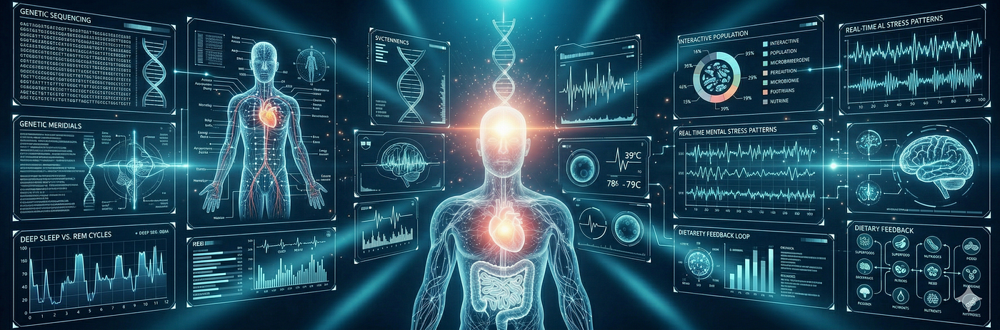
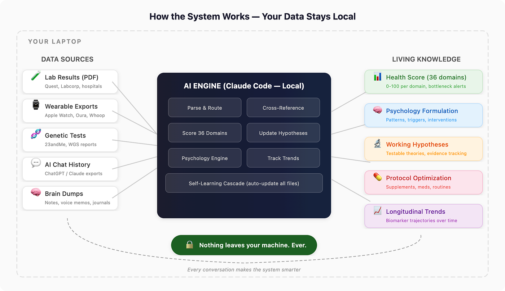
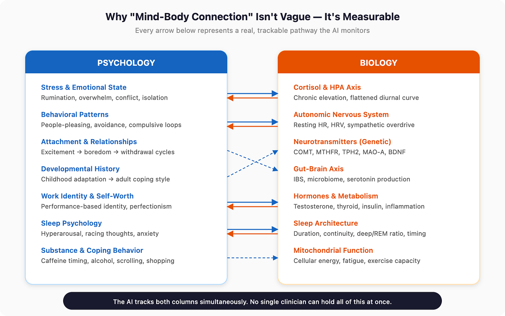
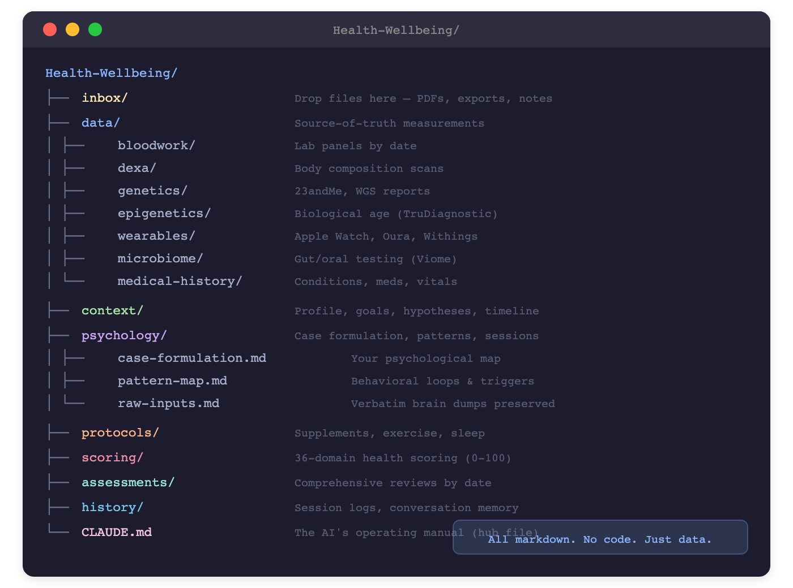
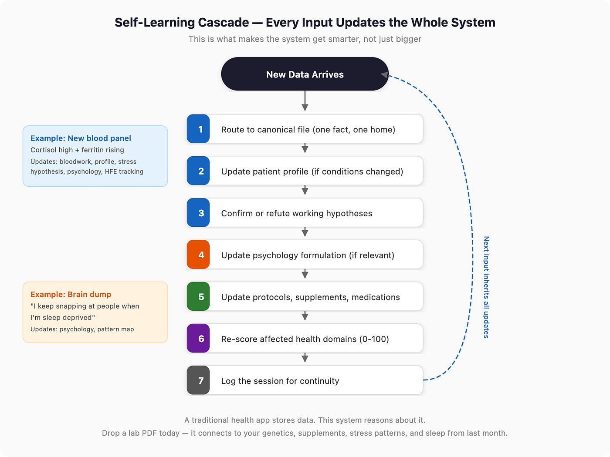
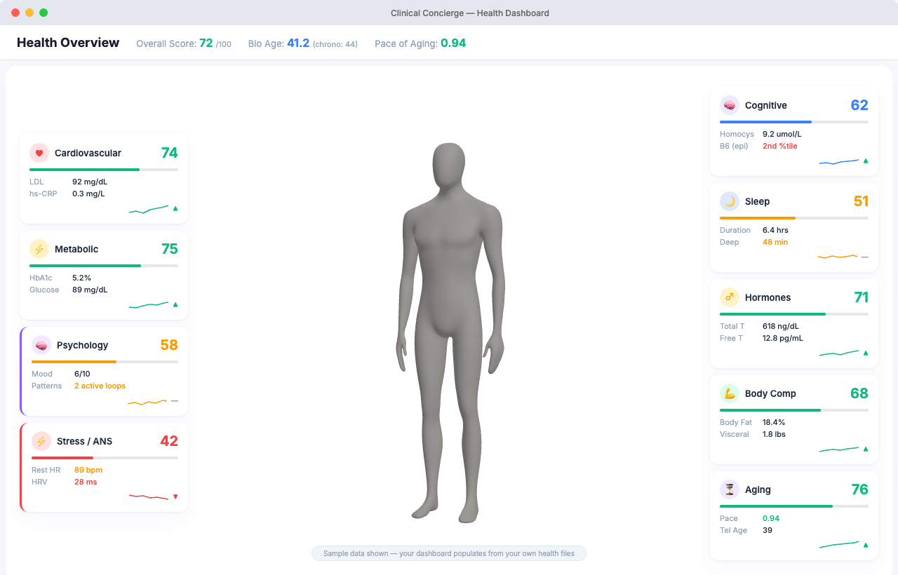

# From 1x to 10x: What Happens When Your AI Health System Sees Your Mind and Body as One

*Originally published on Medium, April 8, 2026*

By Sam Jafari

---

Amir
 highlighted

Amir
 highlighted

Most people give AI their lab results. I gave it my psychology too — alongside blood work, genetics, epigenetics, wearables, and supplements. The system gets smarter with every conversation. Here is how it works and how to build your own.

## The Limitation That Changed Everything

A while ago, I ran into a limitation that changed how I think about AI.

Like a lot of people, I had been using ChatGPT as a thinking partner for health, psychology, and self-understanding. I had uploaded files, written custom instructions, stored context, and spent months building a useful relationship with the system. It was genuinely helpful. Better than starting from zero. Better than talking into the void. Better than scattered notes across apps and folders. But there was a gap.

When I asked it to tell me everything it knew about me, it would often bring back two or three sentences. A short summary. A sketch. Enough to sound personalized, but nowhere near enough to reason deeply. And in biology and psychology, that difference matters.

A rough anecdote is not the same as a real case history.

Knowing that someone “cares about healthspan” or “has explored trauma and mindfulness” is not the same as holding the actual structure of their life in context. It is not the same as understanding their lab trends, medication changes, stress patterns, childhood history, recurring emotional loops, exercise habits, sleep variability, or the way one domain keeps bleeding into another.

That was the moment I realized something important. Cloud AI memory, at least in the form most people use it, is useful but shallow. It gives the feeling of continuity without always carrying the depth required for serious personal work.

## Running the System Locally Changed the Frame

Then I started building local AI coding agents on my laptop. That changed everything.

Once you run the system locally, the whole frame shifts. You are no longer depending on a black box to decide what matters, what gets summarized, what stays in context, or what gets forgotten. You can decide how data is stored, how it is categorized, how it is retrieved, what gets prioritized, and how the system should reason across it. You can define the abstractions. You can choose what the model sees first and what it should link together.

That level of control is far more powerful than most people realize.

It also solves a problem that even the best human doctor or therapist cannot fully solve. No human can hold hundreds of variables in working memory at once and continuously reweave them in real time. Not because they are not smart enough. Because human cognition has limits. A great clinician can notice patterns. A great scientist can understand mechanisms. A great therapist can build formulation. But expecting one person to simultaneously track your childhood dynamics, relationship conflicts, work behavior, dreams, sleep quality, hormone trends, blood biomarkers, genetics, epigenetics, medications, and subjective mood shifts is unrealistic.

AI can. Not because it is magical. Because it is very good at organizing, retrieving, comparing, and synthesizing large amounts of structured and unstructured information at once.

*The full system runs on your laptop. Data flows in from any source, the AI processes and cross-references everything, and a living health model comes out the other side.*

## The Mind-Body Problem Is a Data Problem

This matters most in the place where people get vague very quickly: the so-called mind-body connection.

We hear “mind and body” constantly now. It has become one of those phrases that sounds wise but often hides fuzzy thinking. People say stress affects health. Trauma lives in the body. Hormones shape mood. Nervous system dysregulation changes everything. Most of that is directionally true. But it is usually presented in a way that is either hand-wavy or fragmented.

The real picture is more demanding.

Your psychology affects your biology. Your biology affects your psychology. Your history affects your nervous system. Your nervous system affects your hormone profile, sleep quality, attention, motivation, inflammation, and behavior. Chronic relationship stress can alter sleep and cortisol. Poor sleep can worsen emotional regulation. Low energy can reduce exercise. Reduced exercise can worsen insulin sensitivity and mood. A medication can improve one marker while quietly affecting another. Childhood adaptation can show up decades later as workaholism, hypervigilance, avoidance, or relationship instability. None of these things live in separate boxes.

They are one system.

*Every arrow represents a real, trackable pathway. The AI monitors both columns simultaneously and connects them. No single clinician can hold all of this at once.*

Scientifically, none of this is new. There are thousands of studies on dopamine and drive, serotonin and mood, norepinephrine and arousal, testosterone and motivation, cortisol and stress adaptation, inflammation and depression, sleep and executive function. The knowledge exists. The problem is that it is scattered across papers, specialties, disciplines, and clinical silos. Putting it together for one real human being has been extremely hard.

Until now.

## What I Actually Built

I have been building this for myself. Not as a generic chatbot. As a personal system that ingests every piece of health data I have, connects it, scores it, and reasons across it.

The system is a set of structured markdown files on my laptop, powered by Claude Code running locally. There is no application server, no database, no cloud sync. It is just files, an AI that reads them, and a set of rules that tell the AI how to think about my health.

*All markdown. No code. Just structured data that the AI reads and updates with every conversation.*

## The Data Sources

Over the past six months, I have fed 15+ distinct data sources spanning ten years of health history into this system. Here is what it ingests:

✓Blood panels (Quest, Labcorp — 10 draws, 2016–2025)
✓DEXA body composition scans
✓23andMe genetics (631K SNPs)
✓TruDiagnostic epigenetics (biological age)
✓Viome gut + oral microbiome
✓Apple Watch (HR, HRV, VO2 — since 2017)
✓Withings scale (weight, body comp)
✓Blood pressure (home monitoring)
✓CGM glucose data
✓Sleep tracking (duration, stages, timing)
✓Dental records and treatment plans
✓Eye exam Rx history (3 exams)
✓Skin assessment (Haut.AI)
✓Medical history, medications, immunizations
✓ChatGPT conversation history (1,148 chats)
✓Claude conversation history (188 chats)
✓Brain dumps, journals, therapy notes
✓Clinical visit notes

> You don’t need all of this
The system works with whatever you have. A single blood panel and one honest brain dump about how you are feeling is a useful start. Each new data source you add makes the picture richer, but nothing is required. Start with what is easy and build from there.

You don’t need all of this
The system works with whatever you have. A single blood panel and one honest brain dump about how you are feeling is a useful start. Each new data source you add makes the picture richer, but nothing is required. Start with what is easy and build from there.

## What Makes It Self-Learning

This is the part that separates it from a health app or a folder of files.

Every time new information enters the system — from a lab result, a conversation, a wearable export, or a brain dump — it triggers a cascade of updates across the entire project. The AI does not just store the new data. It walks through every connected file and asks: does this change anything?

*Every new data point triggers this cascade. A cortisol result does not just go into a bloodwork file — it updates your profile, your stress hypothesis, your psychology formulation, and your health score.*

A traditional health app stores data. This system reasons about it. Drop a lab PDF today and it connects to your genetics, supplements, stress patterns, and sleep from last month. That is the compounding effect. Every conversation makes the next conversation more useful.

## The Psychology Engine

The system also has a full psychology compartment that works independently or integrated with the physical health data. It maps behavioral patterns, tracks triggers, preserves raw brain dumps for reanalysis, and maintains a living case formulation that gets updated with every session.

This is where AI chat history becomes a hidden asset. A lot of people have already told ChatGPT or Claude more about themselves than they have written in any journal. They have described fears, fights, patterns, goals, resentment, confusion, health anxieties, dreams, relationship loops, childhood memories, career ambitions, and moments of clarity. That material is incredibly rich. With the right system, it can be extracted, cleaned, categorized, and turned into something far more useful than a pile of old chats.

Combine that psychological archive with biomarker data, and you are no longer talking to a generic assistant. You are talking to a model that has a working map of you.

## The Health Dashboard

I also built a visual dashboard — a local Electron app that reads from the same data files and displays everything in one interface: 36-domain health scoring, biomarker trends, supplement management with genetic flags, and a psychology status panel.

*The health dashboard — shown here with sample data. It reads from the same markdown files the AI maintains, so it is always in sync.*

## The Privacy Advantage

When the whole stack runs on your laptop, your data stays with you. Your histories, biometrics, transcripts, notes, and files do not need to live in someone else’s cloud. For health and mental health data, that matters. It also forces a different kind of ownership: you are responsible for the architecture, the backups, and the rules. Convenience drops a bit. Control rises dramatically.

I think it is worth it.

## What Changes When You Have This

Once the scaffolding is in place, the interaction with AI changes fundamentally. You are not starting from scratch. You can say:

- “I had a strange dream last night” — and it connects to your stress patterns and sleep data.
- “Why am I so tired every Thursday?” — and it cross-references your Wednesday training, supplement timing, and sleep.
- “This lab marker moved and I don’t know if it matters” — and it checks against your genetics, medication list, and trend history.
- “I keep snapping at people when I’m sleep deprived” — and it updates your psychology formulation, links it to your autonomic data, and refines the pattern.

The value is not just in better answers. It is in building a living personal knowledge system that compounds over time.

This does not replace doctors or therapists. AI can hallucinate, overconnect, and sound coherent while being wrong. Use it as an aggregator, a synthesizer, and a hypothesis generator — not as a final authority.

But even with that caveat, the change is real. For the first time, an ordinary person can build something that integrates personal psychology, physiology, measurement, and lived history into one coherent working model. That was previously available only to a tiny number of unusually resourced people.

Not anymore.

## How to Build This Yourself

I have spent six months tuning this system. I extracted the setup as a single file you can paste into Claude Code, and it builds the entire project for you in about five minutes.

## What You Need

- A Mac, Linux, or Windows machine (Windows via WSL)
- Claude Code CLI — install from cli.anthropic.com ($20/month Claude Pro, or pay-per-use API credits)
- Any health data you have (lab PDFs, screenshots, wearable exports — even just notes)
- Optional: Your ChatGPT export (Settings → Data Controls → Export Data)

## Setup Steps

1. Install Claude Code. Follow the instructions at cli.anthropic.com to install the CLI. It takes about two minutes.
2. Create a folder. mkdir ~/Health-Wellbeing && cd ~/Health-Wellbeing
3. Open Claude Code. Run claude in your terminal from that folder.
4. Paste the setup file. Copy the entire contents of the attached setup file and paste it as your first message. The AI reads the instructions and creates the full project — folder structure, CLAUDE.md operating manual, scoring system, psychology templates, all spoke files, everything.
5. Answer the profile questions. The AI will ask you about demographics, conditions, medications, goals. This populates your health profile.
6. Drop data into inbox/. Lab PDFs, wearable exports, screenshots of results. Say "process the files in my inbox" and the AI parses, routes, cross-references, and scores everything.
7. Start having conversations. Ask questions. Do a brain dump. Discuss symptoms. Every conversation updates the system.

## What Happens After Setup

> Day 1: Answer profile questions. Do a brain dump about how you are feeling — physically and psychologically. Drop any lab results you have into inbox/.

First week: Export and drop wearable data. Fill in your supplement stack. Do 2–3 psychology check-ins (just talk to the AI about what is on your mind).

First month: Get a comprehensive blood panel if you do not have recent labs. Ask the AI to run a baseline health assessment. Start one self-experiment.

Ongoing: Drop new data as it arrives. Weekly psychology check-ins. Monthly trend reviews. Quarterly full assessments. The system compounds — every week it knows more than the last.

Day 1: Answer profile questions. Do a brain dump about how you are feeling — physically and psychologically. Drop any lab results you have into inbox/.

First week: Export and drop wearable data. Fill in your supplement stack. Do 2–3 psychology check-ins (just talk to the AI about what is on your mind).

First month: Get a comprehensive blood panel if you do not have recent labs. Ask the AI to run a baseline health assessment. Start one self-experiment.

Ongoing: Drop new data as it arrives. Weekly psychology check-ins. Monthly trend reviews. Quarterly full assessments. The system compounds — every week it knows more than the last.

## If You Have ChatGPT or Claude History

The setup file includes a full pipeline for importing your AI conversation history. It scans every conversation with keyword scoring, extracts the health- and psychology-relevant ones, preserves your exact words, and populates your project with months or years of context you have already generated. If you have been talking to ChatGPT about stress, sleep, supplements, or burnout, that becomes your starting dataset.

> Export your history

ChatGPT: Go to chatgpt.com → Profile → Settings → Data Controls → Export Data. You will receive a ZIP file with all your conversations.

Claude: Go to claude.ai → Settings → Account → Export Data.

Drop the unzipped export folder into inbox/ and tell the AI to process it. The system handles the rest.

Export your history

ChatGPT: Go to chatgpt.com → Profile → Settings → Data Controls → Export Data. You will receive a ZIP file with all your conversations.

Claude: Go to claude.ai → Settings → Account → Export Data.

Drop the unzipped export folder into inbox/ and tell the AI to process it. The system handles the rest.

## The Setup File

The complete setup file is linked below. It is a single markdown document — about 1,700 lines — containing every instruction the AI needs to build your project from scratch. Paste it into Claude Code and the system handles the rest.

→ Download: Personal Health & Performance Project — AI Setup Guide

## Why I Am Sharing This

Not because everyone should become a biohacker or build a quantified-self shrine on their laptop. But because many people are already sitting on the raw material. They already have histories. They already have data. They already ask AI questions they would not ask anyone else. The missing piece is turning that chaos into a system.

Your body is not a dashboard. Your mind is not a separate app. And your life is not a stack of disconnected files.

It is one system.

If you build this and have questions, reach out. If you find ways to make it better, I want to hear about it.

---

*Originally published on [Medium](https://medium.com/@samjafari/from-1x-to-10x-what-happens-when-your-ai-health-system-sees-your-mind-and-body-as-one-fd8660781533), April 8, 2026.*
