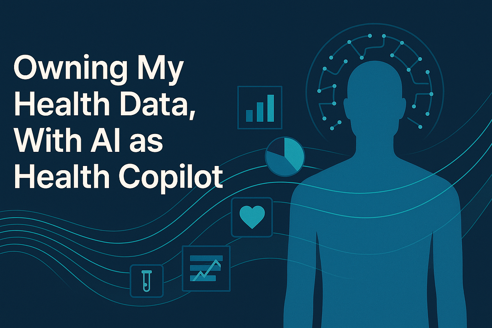
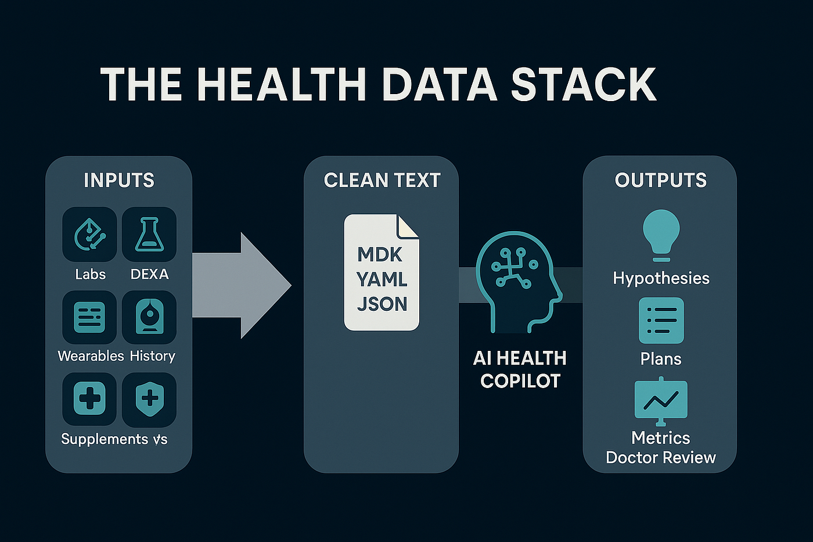

# Owning My Health Data, With AI as Health Copilot

*Originally published on Medium, November 4, 2025*

By Sam Jafari

---

There’s a rhythm to my checkups now. A DEXA printout on the table. A fresh lab panel open on my laptop. Apple Health quietly logging sleep and workouts in the background. I sit down, open my Health Advisor project, and ask one question:

What changed, and what should I do about it?

This is a follow-up to my last post about biohacking as steady, data-guided nudging. No shortcuts. Just deliberate, measurable steps toward more energy, clearer thinking, and lower long-term risk. What follows is the system I use to make that possible. It’s not a doctor. It’s a thinking partner that remembers context, surfaces patterns, and helps me arrive at a reasonable plan before I talk with my clinicians.

> Note for readers: I’ve attached a generic, shareable version of my Health Advisor project prompt so you can build your own. See the “Resources” section at the end.

Note for readers: I’ve attached a generic, shareable version of my Health Advisor project prompt so you can build your own. See the “Resources” section at the end.

## Why I built it

Collecting numbers is easy now. Making sense of them is hard. Labs live in one portal, imaging in another, wearables in a third. Even great clinicians can’t stitch all that together in a 20-minute visit.

With clear instructions and clean inputs, an AI model can pull those threads together. My goal isn’t to replace judgment; it’s to shorten the distance from new data → reasonable plan, so the conversation with my doctor starts closer to the answer.

## What the Health Advisor is

It’s a plain-English brief that tells the model three things:

1. What I’m optimizing for. Energy, cognition, fitness, and prevention.
2. How to reason. Explain mechanisms, grade evidence, propose success metrics, and show risks or interactions.
3. When to defer. Flag anything that needs a clinician’s eyes.

The outcome I want isn’t “do X.” It’s a strong hypothesis I can test and then pressure-test with my physician.

## The inputs that matter

The project is only as good as its data. I keep five sources current and dated:

- Comprehensive labs. Not the 20-marker annual. A true baseline with 100+ markers that cover lipids, insulin sensitivity, inflammation, hormones, and micronutrients.
- DEXA scans. Lean mass, regional fat, bone density, visceral fat. It turns “weight” into something actionable.
- Wearables. Sleep duration and efficiency, resting HR and HRV, activity minutes, workout types.
- Medical history. Diagnoses, procedures, allergies, meds, family history. I sync provider portals to Apple Health, then export.
- Genetic and epigenetic context. Short, dated summaries used as risk context, not destiny.

Rule of thumb: if a number matters, it lives in text with a date. I convert key values to Markdown, YAML, or JSON, rather than relying on raw PDFs. That way the model can parse deterministically and compare apples to apples.

## How I use it day to day

I route most health questions through the project first. Food experiments. Supplement timing. Training blocks. Sleep tweaks. “Am I thinking about this shoulder pain the right way?” The Health Advisor gives me a structured first pass.

For anything serious or persistent, I treat the output as a hypothesis generator. I check citations, ask for mechanism and effect size, and then book time with my physician: here is my data, here is the synthesized plan, what am I missing? That visit begins on third base, not in the parking lot.

A few habits make this work:

- Keep all health conversations in the same project, so context accumulates.
- Even if I speak, I send text. Clean, dated text beats free-form voice for reliability.
- I never assume the model “saw” a number in an attachment. If it matters, I paste it or store it in a text file the project references.

## What the model actually does

It handles the grunt work I used to do by hand:

- Compares new labs to the last snapshot, highlights meaningful changes, ignores noise.
- Translates “normal” into optimal for my goals and shows what to track if I change an intervention.
- Ranks options by expected effect size, risk, and effort.
- Attaches success metrics and retest timing to every plan.
- Checks for interactions between meds and supplements and flags items for physician review.

None of this replaces clinical care. It raises the floor on my own thinking so clinical care can go deeper, faster.

## The guardrails

- Evidence first. Prefer primary sources. Explain the “why,” not just the “what.”
- No guessing. If confidence is low, say so and propose ways to reduce uncertainty.
- Physician gates. Anything with safety implications gets a “doctor required” label.
- Measurable plans. Every recommendation ships with metrics, timelines, and stop/adjust criteria.
- Privacy. Store only what’s useful. Keep exports tidy. Treat health data like financial data.

## Build your own in an afternoon

You don’t need a dev team. Start small.

1. Write a one-page brief in plain English. State your goals, constraints, and rules (including “do not guess”). Ask for evidence grading, risks, dose/timing when relevant, and success metrics.
2. Assemble a baseline pack. One comprehensive lab panel, one DEXA, a month of wearable summaries, and a dated list of meds and supplements.
3. Convert key values to text. Markdown, YAML, or JSON. Always include dates and units.
4. Ask one focused question. Review the plan, then review it with your clinician.
5. Iterate quarterly. Track trends. Retire what isn’t working. Add new experiments carefully.

## What changed for me

The biggest shift is psychological. Numbers stopped being threats and turned into maps. Friends ask if I’m afraid I’ll find something scary. I’m not. Early truth is kind. Most bodies heal when you remove the cause and give them time. My job is to notice early, pick a lever, and measure the effect. AI helps me do that faster and with fewer blind spots.

## Disclaimer

This is my personal process. It is not medical advice. Always review plans and interventions with qualified clinicians who know your history. In my decisions, physician judgment carries the most weight; AI helps me prepare for that conversation.

## Resources

- AI Health Advisor Project Instructions:

Related Post: The Data Stack Behind My AI Health Copilot

---

*Originally published on [Medium](https://medium.com/@samjafari/owning-my-health-data-with-ai-as-health-copilot-c14e9cbc9c93), November 4, 2025.*
