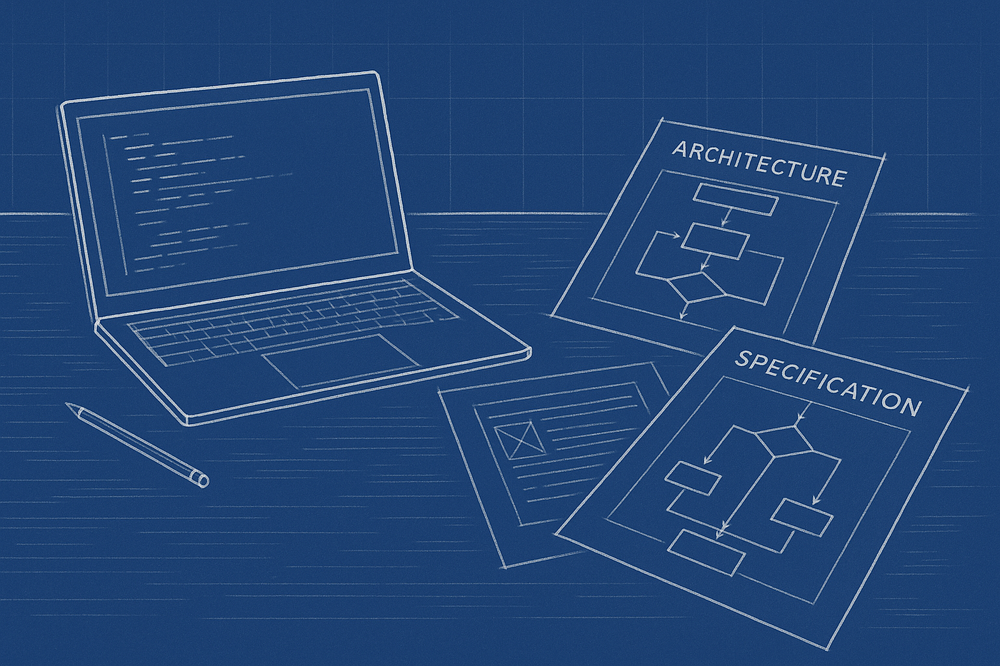
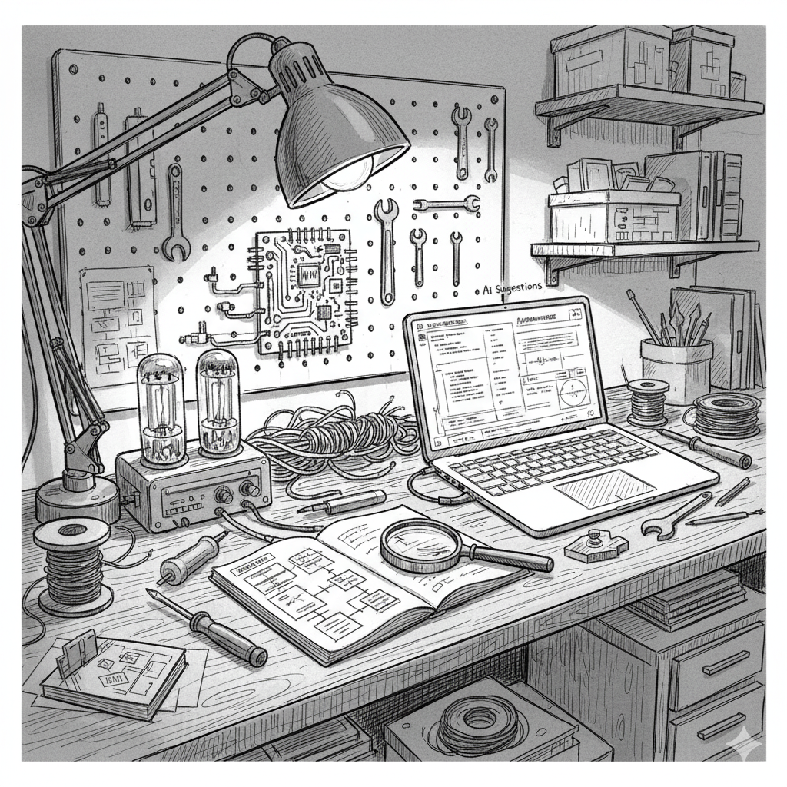

# The Age of Specification: How Software Development Turned Inside Out

*Originally published on Medium, November 18, 2025*

By Sam Jafari

---

*(Follow-up to “The Garage Is Back”)*

A few weeks ago I wrote about the return of the garage. One person, one idea, one machine, and enough conviction to actually build something. That article came out of a personal shift I felt happening in real time. But this new shift has been even more dramatic, and it’s hitting the very core of what it means to “build software.”

It started one night with a simple problem. I had an idea for a tool I wanted to build. A few years ago, even with all my background, I would have needed at least a small team to get anything meaningful off the ground. A frontend person to shape what users see. A backend specialist to stitch data together. Someone to handle infra. Someone to make sure it all didn’t collapse under its own weight. Everyone with their own skill set, their own stack preferences, and their own availability.

This time I opened Cursor, dropped my rough notes and architecture sketches into it, and watched the plan unfold. The code quality wasn’t just passable. It was solid. A year ago that wasn’t true. A year ago you still had to fight the AI to keep it from hallucinating imports or forgetting how its own functions worked. Now it can build something coherent if you give it a clear description. And that is the key. Code is no longer the bottleneck. The bottleneck is clarity.

## The Real Skill Has Shifted

For decades, the currency of software development was fluency in a specific language. Python or JavaScript or Go or C++. People identified themselves by the syntax they were comfortable with. Teams were built around these identities. Job descriptions read like grocery lists of frameworks and libraries. If you couldn’t write the for loops and the if statements cleanly enough, you were out of the game.

That world is fading. Not disappearing, but fading.

The best analogy lives outside software. Before computers, solving a differential equation required learning how to actually solve a differential equation. You needed the technique, the pattern recognition, the algebraic gymnastics. If you couldn’t do those steps by hand, nothing moved forward. Later, calculators took over the mechanical work. Engineers stopped needing to remember the step-by-step solution. What mattered was knowing when to apply the equation, what it meant, and how the result shaped the real-world problem.

Software is entering that same territory.

Line-by-line coding still matters for understanding. It is still the best way to see where the AI might trip, because it does trip. But writing code purely as manual labor is no longer the defining skill. Now the defining skill is specification. The ability to describe what you want a system to do, in precise enough terms that an AI agent can build it.

## A Builder’s Job Is Becoming Architectural

Most people underestimate how much of software development is invisible. It is not typing commands into a terminal. It is deciding what the system is supposed to do. Which components exist. How they talk to each other. Where the data flows. What belongs on the client. What belongs on the server. Which pieces can be reused and which need to be custom.

This is architecture, not syntax.

A lot of people struggle with this part. You see it quickly when someone tries to use an AI coding agent without understanding the underlying structure. They ask the system to “build the whole app,” and what they get back is a polite mess. It resembles software the way a cake drawn by a child resembles a cake. The AI isn’t wrong. It just doesn’t have enough direction.

When you know the architecture, everything changes. A clear front-end layout forces clarity about the backend. A good schema forces clarity about the logic. A good flowchart forces clarity about the data boundaries. Once you know these, you can break the problem down into components, and the AI can assemble each piece with far fewer mistakes.

Good builders today need two things:

1. A clear, detailed specification of what they want to build.
2. A working understanding of modern architecture patterns and how systems fit together.

Everything else can be delegated.

## The New Loop: Brain Dump → Architecture → Specification → Build

When I start a project, I don’t ask the AI to code anything at first. I open a blank note and write exactly what I would tell a human teammate who knows nothing about the idea. I explain the story. The philosophy. The purpose. The user’s flow. The problems I’m trying to solve. I don’t hold back on details or caveats.

Only after that do I break the idea into major pieces. The UI. The API. The data model. The logic. The state. The flow. These aren’t just checkboxes. They force me to confront missing pieces early.

Then I prepare a proper specification prompt, often hundreds of lines long, combining the brain dump with the architecture. That prompt becomes the input to Cursor or Claude Code. The result is usually close to what I imagined. Not perfect, but close. Close enough that the next iteration becomes refinement instead of rescue work.

The “build” step isn’t coding anymore. It’s instructing. Reviewing. Correcting. Iterating.

It feels more like directing a team of tireless junior developers than writing the code yourself. You guide them. They draft. You inspect. They refine. You keep the vision intact.

## A Moment of Transition

We are still early. You won’t build the next Google with an AI agent today. Heavy distributed systems, massive scale, deep custom logic, real-time workloads, complex security — all of that still demands human expertise. But the phase I care about most, the early stage, the idea-to-prototype stage, has been transformed.

One person with clear architectural thinking and a well-written specification can now do what used to require a small team.

This doesn’t eliminate the value of engineers. It elevates the ones who can think in systems. It frees up those who can design clean abstractions. It rewards clarity, not clerical labor. And for people who were locked out of building because they couldn’t write perfect code, a door has opened.

## The Skill of the Next Decade

If I had to bet on one skill for the next decade, it wouldn’t be a programming language. It would be architectural literacy.

Knowing how applications fit together. Knowing how data moves. Knowing how to assemble components that complement each other. Knowing how to describe a system clearly enough that another intelligence, human or artificial, can build it.

That is the new leverage.

And the people who combine that architectural sense with detailed, thoughtful specification will build faster and better than teams ten times their size. Not because they are better coders. Because they know what they want to build and can explain it with precision.

## The Quiet Revolution

A few years from now we’ll look back at this shift and realize it was obvious. Of course the labor of coding would become automated. Of course the real bottleneck would be understanding. Of course architecture would be the differentiator. Of course clarity would be the new currency.

We just weren’t ready to see it yet.

Right now, we are living through the moment when software development stopped being a craft defined by syntax and became a craft defined by thinking. What used to be a matter of typing has become a matter of describing. The builder’s job has turned inside out.

And this time, the garage isn’t just back.  
 It has blueprints taped to the walls.

---

*Originally published on [Medium](https://medium.com/@samjafari/the-age-of-specification-how-software-development-turned-inside-out-68edc24ae467), November 18, 2025.*
