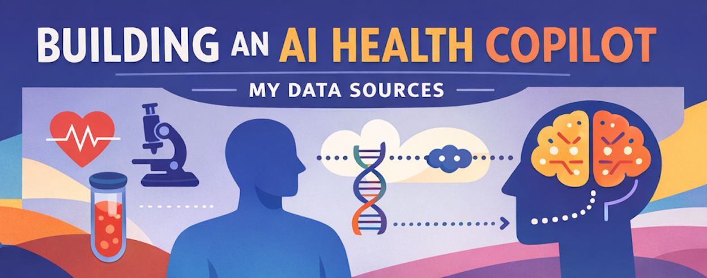
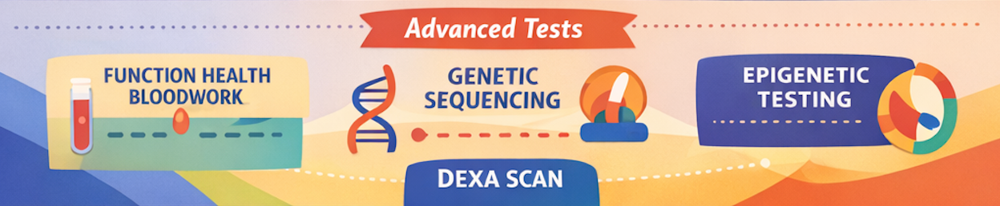
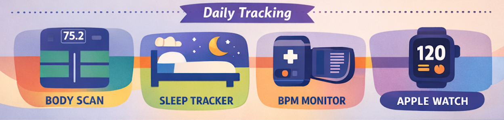

# The Data Stack Behind My AI Health Copilot

*Originally published on Medium, January 26, 2026*

By Sam Jafari

---

## If you want AI to be genuinely useful for health, you need more than vibes. You need real measurements, captured consistently, and organized in a way the AI can actually reason over.

Before ChatGPT (and other tools) started adding native health connectors, I built a simple system: collect high signal health data, keep it structured, and convert it into clean plain text that an AI can read reliably.

Right now, my personal project has roughly **560 measurements** pulled from labs, scans, wearables, medical records, and a small amount of manual input.

This post is a practical checklist. No personal story. Just the stack and the workflow.

## What you are trying to accomplish

AI becomes valuable when it can answer three things with evidence:

1. Where am I right now (baseline)
2. What is changing (trend)
3. What caused the change (training, sleep, diet pattern, meds, supplements, stress, illness)

That only works if your data is:

• timestamped  
• unit consistent  
• repeatable over time  
• stored in a place you can export from

## The tests and data sources I use

## 1. Expanded bloodwork: Function Health

A typical primary care lab panel might include around a **25** common markers. Function Health is designed as a broader panel with **100 plus tests** and states it provides **160 plus lab tests annually** with testing **twice per year** (plus on-demand options)

What it gives you  
• large blood marker coverage  
• repeatability, so you can compare over time  
• a clean structure for exporting and organizing

Link  
[https://www.functionhealth.com/what-we-test](https://www.functionhealth.com/what-we-test)

## 2. Genetics: Sequencing.com

I started with legacy 23andMe data. Today, I generally recommend deeper sequencing so you can reuse it for more analysis over the years.

What it gives you  
• a one time dataset you can use repeatedly  
• variants that can inform risk, sensitivities, and traits  
• helpful context when you interpret labs and symptoms

Link  
[https://get.sequencing.com/shop-all-bundles/](https://get.sequencing.com/shop-all-bundles/)

## 3. Epigenetics: TruDiagnostic

This category adds “biological age style” outputs plus a wider biomarker view, with comparisons relative to population percentiles.

What it gives you  
• a different lens on aging and pace of change  
• biomarker percentiles that help you see where you sit versus broader population distributions  
• another anchor point to track progress over time

Link  
[https://shop.trudiagnostic.com/products/truage-truhealth](https://shop.trudiagnostic.com/products/truage-truhealth)

## 4. DEXA scan: BodySpec

DEXA is my anchor for body composition and bone metrics. Home scales are useful, but DEXA is what I trust for the baseline.

What it gives you  
• body fat and lean mass breakdown  
• visceral fat estimate  
• bone density metrics

Link  
[https://www.bodyspec.com/blog/post/what_are_dexa_scans](https://www.bodyspec.com/blog/post/what_are_dexa_scans)

## 5. Daily measurement: Withings + Apple Watch

This is the everyday telemetry layer. It is not “perfect truth,” but it is consistent, and consistency is what makes trends visible.

### Withings Body Scan scale

This is my daily body composition and cardiovascular style snapshot device.

If you are going to buy it, I would personally consider waiting for **Body Scan 2**, since this category is a real investment at around the $500 level and you want the most current hardware.

Body Scan 2 page  
[https://www.withings.com/us/en/landing/body-scan-2](https://www.withings.com/us/en/landing/body-scan-2)

### Withings Sleep tracker

This gives you passive sleep tracking at home without wearing anything overnight.

What it gives you  
• sleep duration and sleep quality type metrics  
• nightly heart rate trends  
• consistency signals you can compare with training, stress, and food

### Withings blood pressure device (BPM Vision)

The specific BP device I use is **Withings BPM Vision**. I recommend it over simpler cuffs because it is a more advanced product in their lineup.

Withings also has other useful devices in this ecosystem. I do not use them yet, but I may add more over time.

Withings site  
[https://www.withings.com/us/en/bpm-vision](https://www.withings.com/us/en/bpm-vision)

### Apple Watch (workouts and activity)

Apple Watch is my main source for workout capture and activity context.

What it gives you  
• workout sessions and training frequency  
• heart rate trends during workouts  
• activity trends over weeks and months

## 6. Medical history via Apple Health

This is how I centralize my clinical record trail.

I connect provider apps to Apple Health, for example Stanford Health, One Medical, and others, so it pulls medical history, medications, and prescriptions into one place.

Apple Health  
[https://www.apple.com/ios/health/](https://www.apple.com/ios/health/)

## 7. Historical labs from Labcorp and Quest

A lot of older lab data sits in portals. If you want AI to be useful, you need your history, not just the last test.

What I do  
• download PDFs from portals  
• extract the markers into structured text  
• merge them into a single chronological dataset

Quest  
[https://myquest.questdiagnostics.com/](https://myquest.questdiagnostics.com/)

Labcorp  
[https://www.labcorp.com/patients](https://www.labcorp.com/patients)

## 8. Skin assessment via photo analysis (Haut.AI)

For skin tracking, I use photo based assessment as an additional consistent input over time.

Link  
[https://haut.ai/](https://haut.ai/)

## Manual inputs that are one time setup, then update only on change

This is important. You do not need to manually log everything forever. You just need stable context that you update when it changes.

## 9. Workout routine and training structure

I enter my current routine once: split, goals, typical weekly schedule, and sport activities. Then I only update it when I change the program.

## 10. Supplements, peptides, prescriptions, and over the counter meds

I enter the list once with dose and schedule. Then I only update when something changes.

Minimum fields that matter  
• name  
• dose  
• schedule  
• start date  
• stop date (when applicable)  
• reason for adding or stopping

## 11. Eating pattern, cuisines, and constraints

This is not calorie tracking. It is pattern tracking.

I enter once  
• typical eating pattern  
• cuisines and food preferences  
• constraints and sensitivities  
• alcohol frequency  
• anything I am deliberately avoiding or emphasizing

Then I update only when the pattern changes.

## The workflow that turns raw data into AI ready context

## Step 1. Export everything you can

Prefer structured exports when available. If not, PDFs are fine. Just be consistent.

## Step 2. Normalize to a simple schema

Every measurement becomes a row with:

• marker name  
• value  
• unit  
• date and time  
• source (device, lab, scan)  
• context tags when relevant (fasted, sick, post workout, new medication)

## Step 3. Convert to plain text summaries

AI works best when you give it clean text that is easy to parse.

I keep a plain text “health brief” that includes:  
• my profile and baseline  
• latest key markers with dates and units  
• trends over time  
• current training plan and diet pattern (only updated when changed)  
• current meds and supplements (only updated when changed)  
• current issues, hypotheses, and what I am testing next

## Step 4. Keep the project context updated

Numbers alone are not enough. AI also needs your storyline.

When something important happens, new diagnosis, medication change, confirmed root cause, a resolved symptom, I update my project instructions or memory so the AI stops guessing and starts recalling.

## A simple starter plan most people can follow

1. Choose one broad lab source and do it twice per year.
2. Add DEXA occasionally for body composition and bone baseline.
3. Add daily basics: weight, blood pressure, sleep, activity.
4. Export old labs from portals and centralize them.
5. Enter your routine once: training, meds and supplements, food pattern. Update only on change.
6. Once a month, refresh your plain text health brief.

If you do only that, AI can become dramatically more specific and useful, because it finally has the inputs needed to reason about your real baseline and your real trends.

Related Post: [Owning My Health Data, With AI as Health Copilot](https://medium.com/@samjafari/owning-my-health-data-with-ai-as-health-copilot-c14e9cbc9c93)

---

*Originally published on [Medium](https://medium.com/@samjafari/the-data-stack-behind-my-ai-health-copilot-2e309ee8954a), January 26, 2026.*
