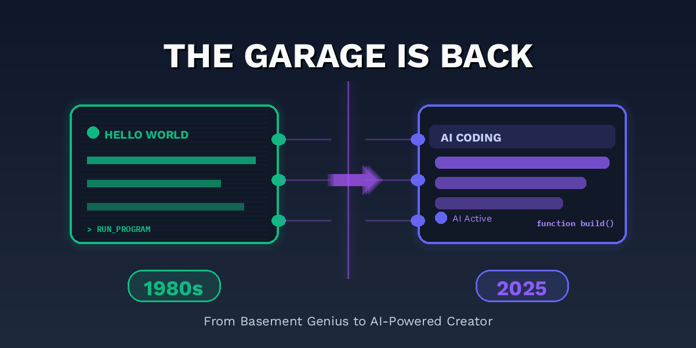
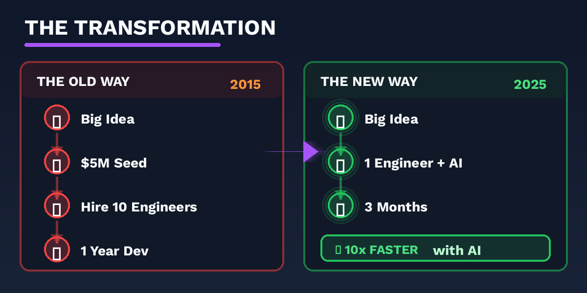
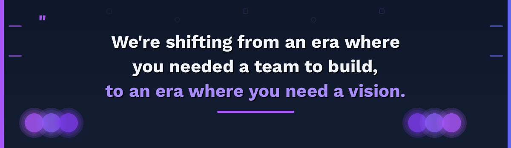

# The Garage is Back: How AI is Bringing Back the Golden Age of Software Development

*Originally published on Medium, October 20, 2025*

By Sam Jafari

---

## Remember the Garage

Picture a dimly lit basement sometime in the 1980s. A single developer sits hunched over a glowing terminal, green text scrolling across the screen. There are no meetings to attend, no standups to join, no committees to convince. Just someone building something they believe in. From spaces exactly like this came Apple and Microsoft, along with countless other innovations that shaped how we live today.

Now jump forward to just a few years ago. The scene looks nothing like that garage. Want to build even a straightforward mobile app? You need to assemble a team of 10 to 20 engineers. Frontend developers to handle what users see. Backend engineers to manage the data. DevOps specialists to keep everything running. QA testers to catch the bugs. Data scientists to make sense of the metrics. The real challenge isn’t the money, though you’ll need millions in venture capital. The real challenge is finding these people and convincing them to join you when every big tech company is competing for the same talent.

But right now, something remarkable is unfolding. We’re returning to that garage era, except this time the lone developer has something those pioneers never had: the full power of modern technology. AI coding assistants and open-source software are reshaping what one person can accomplish.

## When Did Building Get So Complicated?

Software development didn’t become complex by accident. Over the past decade, we built systems more powerful and more scalable than anything that came before. Cloud infrastructure gave us global reach. Microservices let us build resilient systems. Modern frameworks enabled rich user experiences.

Each advance brought new specialization. Frontend frameworks evolved so rapidly that keeping up became a full-time job. Backend systems grew into intricate webs of services that needed constant orchestration. DevOps emerged as its own discipline, complete with its own tools and philosophies. The expertise required to build something meaningful kept expanding.

This complexity carried a cost. The barrier to entry climbed higher and higher. Entrepreneurship became less about building and more about fundraising. The solo innovator gave way to the well-funded team. Ideas that might have flourished in an earlier era died in pitch decks because assembling the right group of specialists proved impossible.

## Welcome to the Renaissance

Two forces are converging. AI coding assistants have matured into genuinely useful tools. The open-source ecosystem has grown into a vast library of battle-tested components. Together, they’re creating possibilities that seemed impossible just months ago.

Consider what today’s AI agents can do. They write boilerplate code in seconds. They debug with endless patience. They generate comprehensive tests. They can even suggest architecture, drawing from patterns they’ve learned across millions of projects. It’s like working alongside a junior developer who never sleeps, a DevOps expert who never complains, and a QA engineer who never misses a detail.

But here’s what matters: AI doesn’t replace you. It amplifies you. It handles the repetitive patterns and the tedious boilerplate. You focus on what humans do best: understanding the core problem, envisioning the solution, making creative leaps. You’re not competing with AI. You’re working with it, the way a composer works with an orchestra.

Layer in the open-source ecosystem. Projects like those from Apache Projects, tools like LangChain, thousands of libraries refined by communities over years. Everything you need to build production-quality applications sits there, documented and supported. Infrastructure that once required teams of specialists is now accessible to anyone willing to learn.

## My Own Journey

I’ve carried a vision for years. I wanted to build something that would return the power of data to the people who generate it. Something that would transform raw device data into insights, recommendations, and real solutions. Something that would help thousands of engineers, scientists, and executives actually understand and use the information their systems produce.

I tried the traditional path. I tried building a team. Finding skilled engineers proved nearly impossible when every major tech company was competing for the same people with compensation packages I couldn’t match. Five years and dozens of engineers later, I had something partially built and perpetually incomplete. The vision remained just out of reach.

Today looks different. With Cursor, Claude Code, Gemini, ChatGPT, LangChain, and tools from the Apache ecosystem, I’m building a functional MVP myself. The barrier between conception and creation has simply vanished. What once required a team of ten specialists and months of fundraising now requires one person with clarity of vision and the right AI tools.

## The Great Reallocation

We should talk about the layoffs. They’re real, widespread, and affecting talented people. But there’s another way to understand what’s happening. This is a massive redistribution of human potential.

Think about it. Thousands of skilled engineers who were maintaining legacy systems and sitting through endless meetings are suddenly free. Free to build what they believe in. Free to pursue ideas they’ve been carrying around. Free to take risks they couldn’t take before. These people have skills, experience, and now they have time and motivation.

Combine this liberated talent with AI tools that multiply individual productivity by an order of magnitude, and you get the conditions for an explosion of innovation. This is the counterargument to the fear that AI destroys jobs. AI isn’t eliminating opportunities. It’s creating a new generation of builders and owners. It’s democratizing the ability to create, bringing us back to an era where ideas matter more than org charts.

## Building Over Fundraising

We’re at an inflection point. The era of building real products that solve real problems is coming back. The focus is shifting from raising capital to spend on large teams toward building lean, focused solutions that customers actually want.

That garage developer has returned, but supercharged. They have access to the collective knowledge of millions of codebases. They have AI assistants that never forget and never tire. They have open-source tools that would have cost millions to build a decade ago. All of it available, documented, ready to use.

This isn’t a story about AI replacing humans. It’s about technology empowering individuals to reach their full potential. About returning creative agency to builders. About making entrepreneurship accessible to anyone with vision and persistence, not just those who can navigate venture capital networks.

## Your Turn

I’m curious what you’re seeing. What have you built with AI that you couldn’t have before? Are you noticing this shift toward individual creators? Do these tools feel empowering, or are you running into different challenges?

Share your experience in the comments. The future is being built right now in garages and coffee shops and home offices everywhere. This time, it’s not about who has the biggest team. It’s about who has the clearest vision.

---

*Originally published on [Medium](https://medium.com/@samjafari/the-garage-is-back-how-ai-is-bringing-back-the-golden-age-of-software-development-e01e436fe687), October 20, 2025.*
