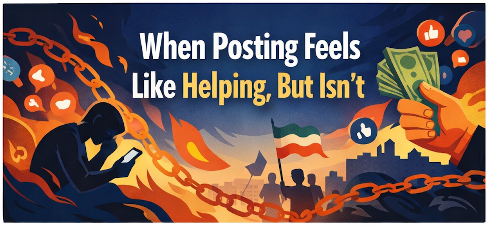
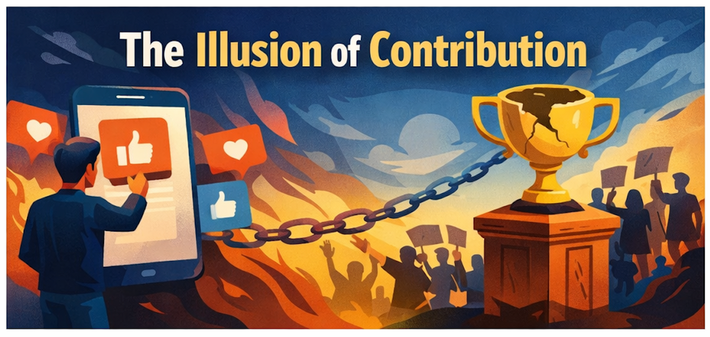
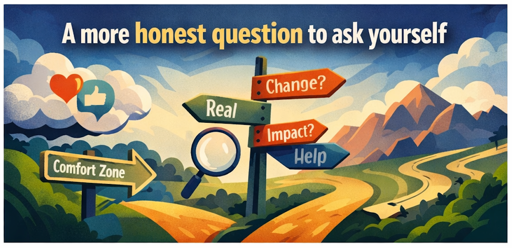

# When Posting Feels Like Helping, But Isn’t

*Originally published on Medium, January 21, 2026*

By Sam Jafari

---

## A calmer, more effective way for the Iranian diaspora to respond

I know the feeling well.

Something horrific happens in Iran. A video hits Instagram. My chest tightens. I scroll. I repost. For a few minutes, I feel like I’ve done something. Then the next clip arrives. And the next. The anxiety grows. Sleep gets worse. The sense of helplessness deepens.

For many Iranians living outside the country, social media has become the main interface with home. During uprisings and crackdowns, it feels almost immoral to look away. So we don’t. We consume everything. We repost everything. We suffer together.

The hard truth is that most of this activity is not helping protesters on the ground. It is mostly hurting the people watching, and feeding the business models of the platforms hosting the content.

This is not about blaming anyone. The impulse to act is human. But the mechanism we’re using is deeply flawed.

## Why social media pulls us in harder during crises

Modern platforms are optimized for attention, not truth, not impact.

Graphic, emotionally charged content reliably produces engagement. Algorithms learn this quickly. During violent political events, the feed often surfaces the most disturbing material because it keeps people watching, sharing, reacting.

Your nervous system was not built for repeated exposure to violence in a loop. When you watch it over and over, your stress response stays on. You can feel “in Iran” without being there. That is not virtue. That is biology meeting a machine designed to monetize your attention.

This pattern even has a name now: doomscrolling. And it tends to correlate with worse anxiety and distress, not better action.

## The illusion of contribution

Posting feels like action because it’s public and immediate. But in most cases, it is expressive, not instrumental.

It scratches a real itch: “I can’t change what’s happening, but I can show I care.” That can give a short hit of relief.

The risk is that the post becomes the reward. You get the psychological payoff of participation without the hard, boring steps that actually move levers.

That’s how we end up in a cycle: more clips, more stress, more posting, less impact.

## “But social media creates awareness and helps people organize”

This is usually where the conversation turns defensive, so let’s slow it down and separate what’s partly true from what’s mostly misunderstood.

## “We’re creating awareness in our network”

Awareness matters. No movement succeeds in total darkness.

But for the Iranian diaspora, there’s a practical limit: much of the engagement around Iran protest content is happening inside Iranian circles already. If your audience is mostly Iranian or already Iran-adjacent, reposting often circulates the same content inside the same bubble.

Instead of expanding awareness outward, we mostly recirculate it inward, and intensify collective anxiety.

There’s also a saturation effect: once someone understands the basics, additional graphic exposure usually does not increase understanding. It increases numbness, despair, rage, or helplessness. Those states do not translate into sustained, strategic action.

## “Social media helps organize protests and demonstrations abroad”

This one sounds strong, and it’s not completely wrong.

Social platforms can help with logistics: time, place, last-minute updates, route changes. But logistics are not the same as durable organizing.

What actually sustains a movement abroad is infrastructure: trusted organizers, clear goals, consistent communication, follow-through after the march ends, and steady pressure on institutions. Social media excels at sparks. It is weak at infrastructure.

There’s another problem that’s rarely named: constant doomscrolling undermines people’s capacity to show up physically. Chronic stress reduces energy, sleep quality, motivation, and attention. Many people also feel they already “participated” by posting, which paradoxically lowers the chance they will attend a protest, donate, call representatives, or commit to ongoing work.

## The hidden opportunity cost

Every hour spent scrolling graphic content is an hour not spent on:

- coordinated political pressure where you live
- fundraising for credible initiatives
- building calm, trusted information channels
- supporting digital infrastructure and legal work
- recovering emotionally so you can stay engaged for the long game

Social platforms don’t just consume attention. They convert moral energy into platform revenue, while leaving the underlying situation unchanged.

## A more honest question to ask yourself

Before posting or reposting, ask one simple thing:

**Does this protect someone, fund someone credible, change a real policy lever, or strengthen reliable information flow?**

If the answer is no, the post is probably helping you cope, not helping Iran.

There’s nothing shameful about coping. But we should be honest about what we’re doing.

## What actually helps more than doomscrolling

If you want your energy to matter, especially living outside Iran, these tend to have higher impact than reposting graphic clips.

## 1) Support information and connectivity work

Crackdowns often rely on confusion, fragmentation, throttling, and shutdowns. Supporting reputable digital rights work that pushes back on shutdowns, funds secure communications, and documents disruptions is real contribution.

Even if you do nothing else, shift some of your “time budget” into funding and supporting the infrastructure that helps people communicate.

## 2) Support credible human-rights documentation and legal efforts

Verified documentation is what turns outrage into accountability. Random clips with no provenance might spread emotion, but they are often unusable for investigators and journalists. Support organizations and efforts with a track record of evidence handling.

## 3) Apply pressure where you actually have leverage

If you live in the US, Canada, Europe, or Australia, your leverage is political and institutional. Calls, letters, meetings, and testimony aimed at specific, enforceable actions tend to beat reposting.

The important part is specificity. “Do something” does nothing. “Support X investigation,” “fund Y program,” “protect Z group,” those can be tracked and pressured.

## 4) Become a filter, not an amplifier

One of the most valuable roles in the diaspora is calm curation: a weekly digest, clear labels (confirmed, unconfirmed, analysis), translation without exaggeration, and links to credible sources. This reduces panic and misinformation in our own communities.

## A nervous-system-safe protocol, not a moral one

If you or your friends feel overwhelmed, this is not about caring less. It’s about staying functional.

- Turn off autoplay and graphic previews
- Time-box Iran news (two short windows per day, not all-day grazing)
- Replace constant posting with one concrete action per week that costs real effort or resources
- If you share, share actions and verified updates, not trauma loops

This isn’t disengagement. It’s sustainability.

## A calmer way forward

I previously wrote a separate piece on using AI to stay informed about Iran without drowning in social media and emotional manipulation. It’s designed to reduce noise, verify information, and keep your nervous system out of the algorithmic stress loop.

**“A Calmer Way to Follow Iran: Let an AI Agent Do the Digging, Not Your Nervous System”**  
[https://medium.com/@samjafari/a-calmer-way-to-follow-iran-let-an-ai-agent-do-the-digging-not-your-nervous-system-86835d3c14a1](https://medium.com/@samjafari/a-calmer-way-to-follow-iran-let-an-ai-agent-do-the-digging-not-your-nervous-system-86835d3c14a1)

This post and that one belong together. One is about information hygiene. This one is about psychological and strategic hygiene.

Caring deeply does not require suffering endlessly. And posting is not the same thing as helping.

## FAQ

## “So should we never post about Iran?”

No. Post, but make it count. Prioritize: verified updates, actionable links, fundraising with accountability, calls to specific actions. Avoid recycling graphic clips that mainly spike distress.

## “But if we don’t share videos, people will forget.”

People don’t forget because you post more gore. They forget because there is no sustained structure that keeps pressure on institutions. Consistency beats intensity. Weekly actions beat hourly scrolling.

## “Are protests abroad useless then?”

Not useless. But protests alone are not enough. A demonstration is strongest when it is paired with follow-through: fundraising, coordinated lobbying, media outreach, and ongoing organizing that continues after the day-of emotion fades.

## “Isn’t sharing content how we fight propaganda?”

It can be, if it is verifiable and targeted. Propaganda is fought with credibility, not volume. Fewer, higher-quality shares are better than a flood of unverified content.

## “I feel guilty when I stop checking.”

That guilt is a sign of care, not a sign of effectiveness. Your job is not to absorb suffering as proof of loyalty. Your job is to stay well enough to be useful.

## “What if my scrolling is the only thing I can do right now?”

Then treat it as what it is: emotional coping. Keep it time-boxed, avoid graphic loops, and pick one small weekly action that is real (donate, call, volunteer, coordinate). Small and steady beats intense and collapsing.

## “What’s one simple rule to remember?”

If your action doesn’t protect someone, fund someone credible, change a policy lever, or strengthen reliable information flow, it’s probably self-soothing, not support.

If you want, I can also produce a shorter “share by DM” version (300 to 400 words) you can send to friends without it feeling like a lecture.

---

*Originally published on [Medium](https://medium.com/@samjafari/when-posting-feels-like-helping-but-isnt-9c0b5e3edf3c), January 21, 2026.*
